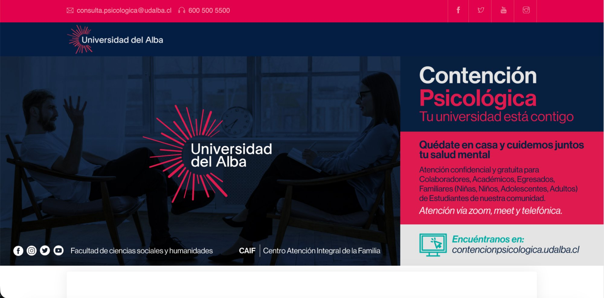
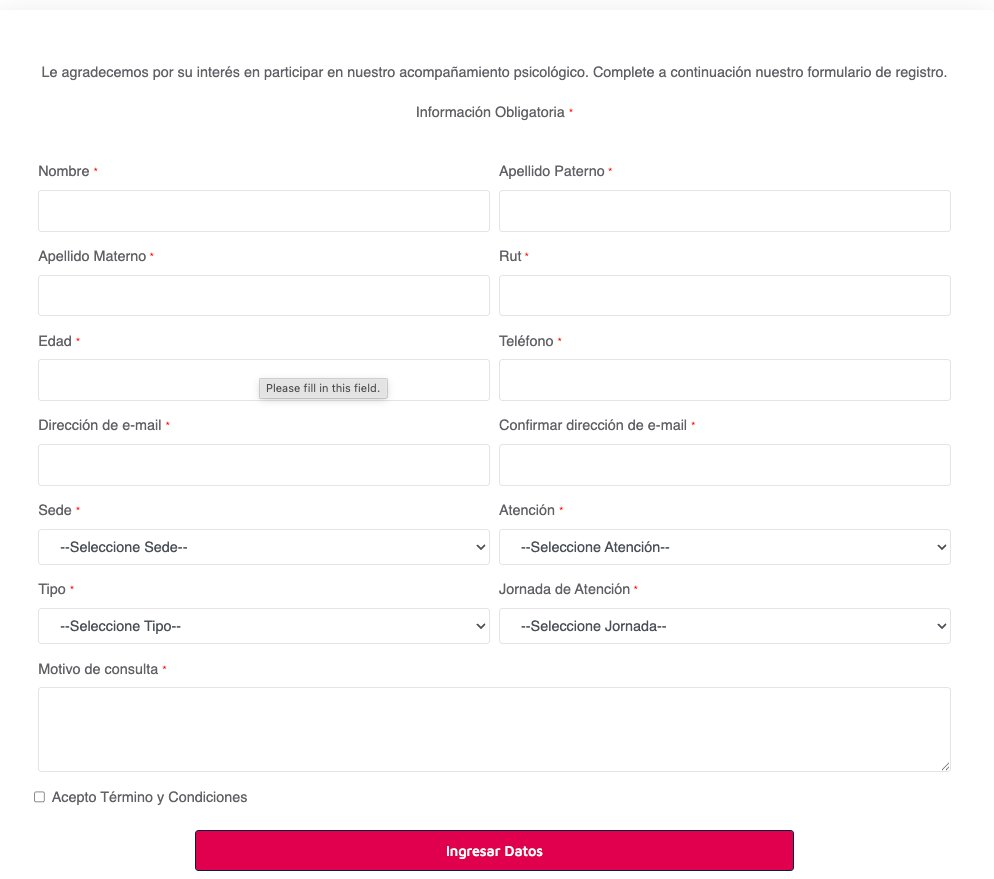

# Contención Psicológica

Telehealth platform for psychological support during the COVID-19 pandemic at Universidad del Alba, Chile.

🔗 **URL:** [contencionpsicologica.udalba.cl](https://contencionpsicologica.udalba.cl/)

## Overview

Built during the pandemic to provide free, confidential psychological support to the university community. The platform allows students, staff, and their families to book remote consultations with psychologists via Zoom, Google Meet, or phone.

## Context

During COVID-19 lockdowns, mental health support became critical. This platform was developed to ensure the university community could access psychological care remotely, maintaining confidentiality and ease of access.

## Screenshots

### Landing Page

*Main page with information about the psychological support service*

### Appointment Booking

*Registration form for scheduling consultations*

## Features

- **Online Booking** — Schedule appointments with psychologists
- **Multi-campus Support** — Select your campus (sede) for localized care
- **Flexible Scheduling** — Choose appointment type and time slot
- **Multiple Channels** — Consultations via Zoom, Meet, or phone
- **Confidential** — Secure handling of sensitive patient information
- **Free Service** — No cost for university community members

## Users

- Students
- Academic staff
- Administrative staff (Colaboradores)
- Alumni (Egresados)
- Family members (children, adolescents, adults)

**Approximate users:** 50-100 during pandemic period

## Tech Stack

- **Backend:** Laravel 5, PHP
- **Frontend:** Blade, Bootstrap 4, HTML5
- **Database:** MySQL
- **Hosting:** University infrastructure

## Form Fields

The booking system captures:
- Personal information (Name, RUT, Age, Phone, Email)
- Campus selection (Sede)
- Appointment type (Atención)
- Session type (Tipo)
- Preferred schedule (Jornada)
- Reason for consultation (Motivo de consulta)
- Terms acceptance

## Client

**Universidad del Alba**  
Centro Atención Integral de la Familia (CAIF)  
Facultad de Ciencias Sociales y Humanidades

## Contact

**Marcelo Toro**  
Full Stack Developer

- 📧 mtoro6@gmail.com
- 💼 [LinkedIn](https://linkedin.com/in/marcelo-toro-toro)
- 🌐 [Portfolio](https://marcelo-toro-portfolio.netlify.app/)
